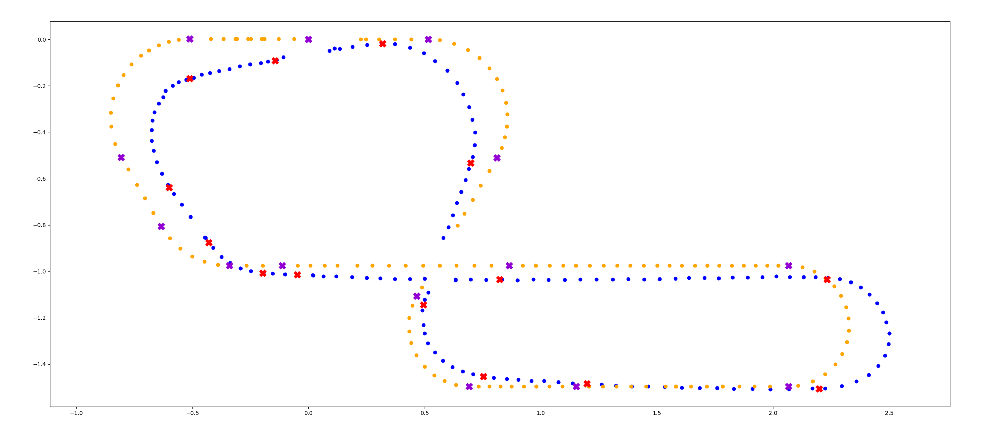
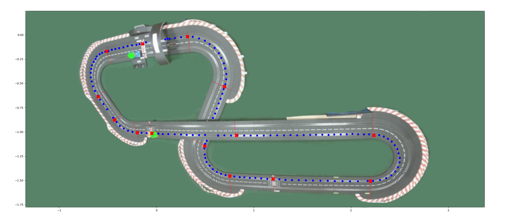
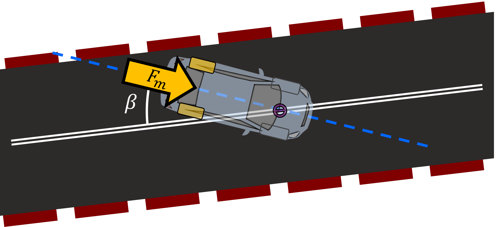
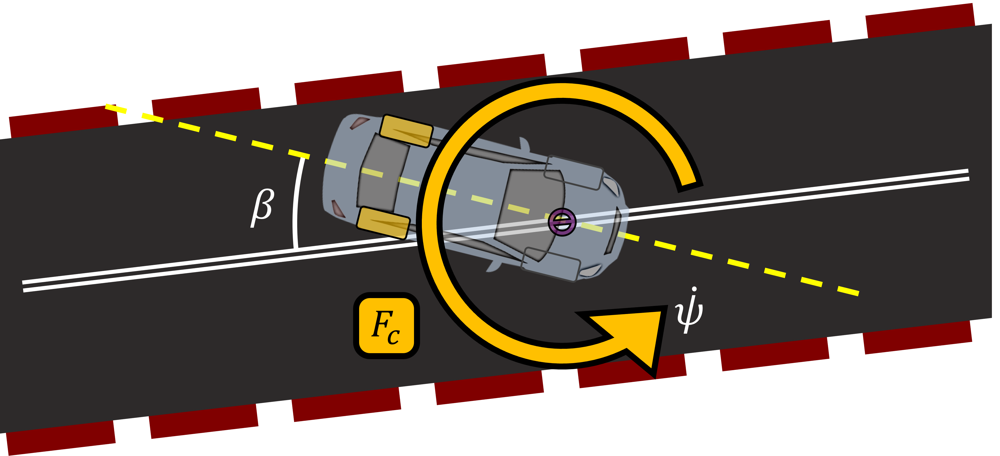
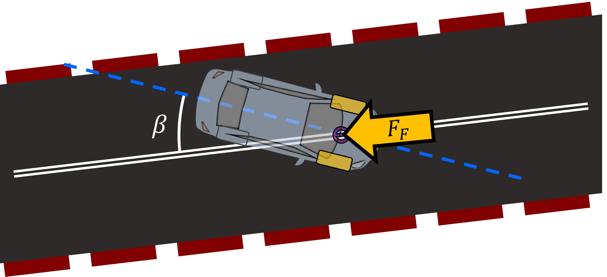
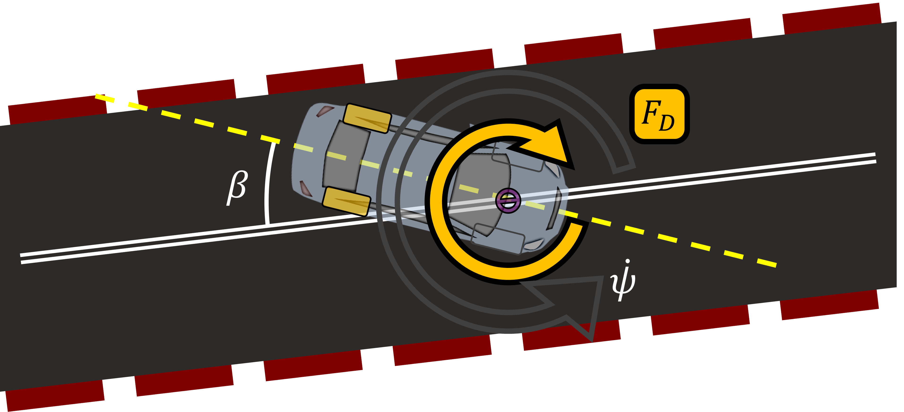
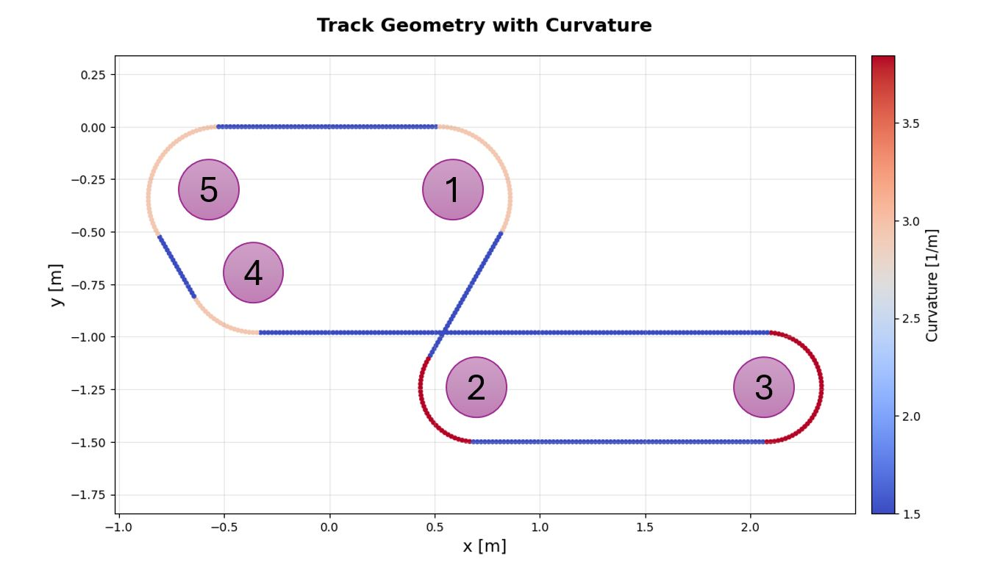
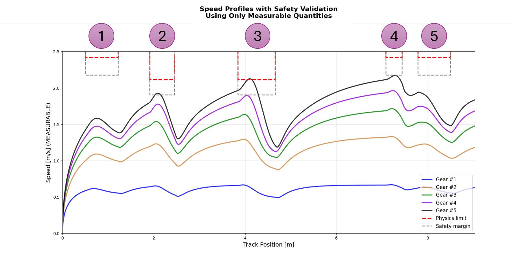
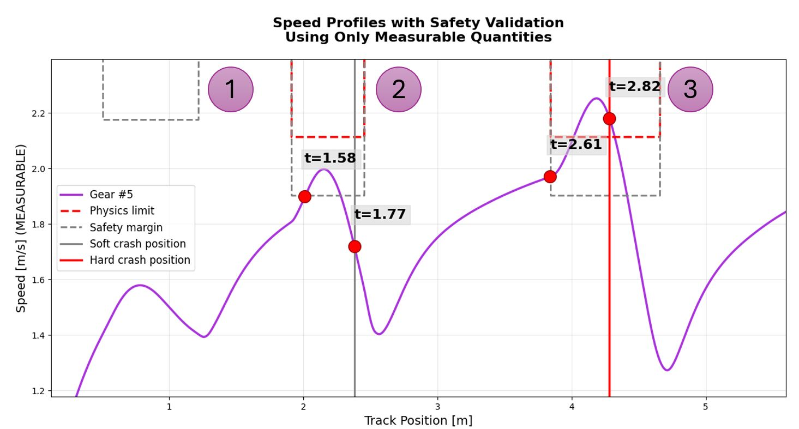

# Refined Dynamics Model with Novel Crash Prediction and Optimal Control for Carrera Slot Cars

> Modeling Project, October 2025
>
> *Authors:* Mehdi Hassanbeigi, Juan Pablo Ponce de Leon Eyl  
> *Supervised by:* Thomas Rau, Shivam Sundriyal  
> *In association with:* Method Park by UL Solutions, Erlangen

---
## Overview

This project develops a **physics-based simulator** for Carrera slot cars, building upon a 2024 baseline model derived from Euler–Lagrange mechanics. The 2025 work delivers three major contributions:

1. **Refined dynamics model** — corrects the drivetrain to rear-wheel drive, replaces the guide-pin spring with tire cornering stiffness, and introduces a slip-dependent friction law, reducing the fitted parameter set from five to four.
2. **Novel crash prediction framework** — replaces the unmeasurable drift-angle threshold with a force-balance criterion using only velocity and precomputed track curvature.
3. **Model Predictive Control (MPC)** — optimizes discrete gear selection to minimize lap time while enforcing safety constraints, achieving up to **17% improvement** over fixed-gear operation.

---

## Table of Contents

- [Track Modelling (Chapter 2)](#track-modelling)
  - [Segment-Based Track Representation](#segment-based-track-representation)
  - [Geometric Correction of Experimental Data](#geometric-correction-of-experimental-data)
- [2025 Dynamics Model (Chapter 3)](#2025-dynamics-model)
  - [Car Representation](#car-representation)
  - [What Changed from 2024 to 2025](#what-changed-from-2024-to-2025)
  - [Force Models in Detail](#force-models-in-detail)
  - [Complete Euler–Lagrange Derivation](#complete-euler-lagrange-derivation)
  - [Final Equations of Motion](#final-equations-of-motion)
  - [Parameters and Validation](#parameters-and-validation)
- [Crash Prediction Framework (Chapter 4)](#crash-prediction-framework)
  - [2024 Geometric Criterion (Replaced)](#2024-geometric-criterion-replaced)
  - [2025 Force-Balance Criterion](#2025-force-balance-criterion)
  - [Crash Visualization](#crash-visualization)
- [Optimal Control via MPC (Chapter 5)](#optimal-control-via-mpc)
  - [Problem Formulation](#problem-formulation)
  - [Constraints](#constraints)
  - [Receding-Horizon Greedy Gear Search](#receding-horizon-greedy-gear-search)
  - [Results](#results)
- [Conclusion (Chapter 6)](#conclusion)
- [References](#references)

---

## Track Modelling

Accurate and efficient modelling of the racetrack is fundamental for correct simulation of the slot car dynamics. This section introduces a **segment-based representation** of the tracks, contrasting it with the previous B-spline approach, and explains how experimental data is mapped onto the simulation domain.

### Segment-Based Track Representation

The Carrera racetrack is built from only three physical piece types: **straight**, **60° right curve**, and **60° left curve**. We introduce a segment-based representation where the track is decomposed into a sequence of base segments, each defined by:

| Property | Description |
|----------|-------------|
| Length $\ell_s$ | Arc length of each segment in meters |
| Radius $r$ | Fixed radius for curves ($\infty$ for straights); negative encodes right turns |
| Curvature $\kappa$ | Reciprocal of the absolute radius: $\kappa = 1 / \|r\|$ |
| Type | `"straight"`, `"left"`, or `"right"` |

Starting from an origin point with zero heading, each segment is discretized into sampled points. At each point, the cumulative arc length, heading angle, curvature, radius, Cartesian coordinates, and first/second derivatives with respect to arc length are recorded. The result is a fully parametric representation:

$$
\text{track}(q) := \left\lbrace r(q),\; \kappa(q),\; \varphi(q),\; x(q),\; x'(q),\; x''(q),\; y(q),\; y'(q),\; y''(q) \right\rbrace
$$

Interpolation functions provide $O(1)$ constant-time lookup at any arc-length position. This is implemented in `track.py` via the `Track` class, which stores precomputed arrays `pt_q`, `pt_x`, `pt_y` and provides methods `kappa(q)` and `phi(q)`.

**Why not B-splines?** The 2024 project used B-splines, which introduced:
- Constant position errors from knot-vector parameterization not matching physical arc length
- Derivative discontinuities at straight-to-curve transitions that broke tangent angle computation
- Higher computational cost (recursive basis function evaluation vs. $O(1)$ lookup)
- Global propagation of local control point changes, making geometry tuning difficult

The segment-based model eliminates all of these issues and mirrors how physical racetracks are actually assembled.

### Geometric Correction of Experimental Data

Raw video recordings introduce distortions from camera placement, lens curvature, and perspective projection. A two-stage correction pipeline maps experimental data onto the simulation domain.

**Stage 1 — Affine transformation:**

$$
\begin{pmatrix} u \\ v \end{pmatrix} = \begin{pmatrix} a_{11} & a_{12} \\ a_{21} & a_{22} \end{pmatrix} \begin{pmatrix} \tilde{u} \\ \tilde{v} \end{pmatrix} + \begin{pmatrix} b_1 \\ b_2 \end{pmatrix}
$$

Coefficients are obtained by least-squares from four corner control points provided by the computer vision system.

**Stage 2 — Arc-length mapping via points of interest:**

The track is segmented into 14 geometric sections at designated points of interest. For each lap, recorded positions are partitioned by minimizing the Euclidean distance to known control point coordinates:

$$
\min_{i} \sqrt{(u_i - u_c)^2 + (v_i - v_c)^2} \quad \text{for } c \in \text{P.o.I.}
$$

<p align="center">
  
</p>
<p align="center"><em>The 14 numbered points of interest (white circles) overlaid on the physical racetrack photograph, used to segment the track into geometric sections for domain mapping. Blue dots show the tracked car positions along the slot.</em></p>

Normalized arc-lengths are computed in both the experimental $(u,v)$ and simulation $(x,y)$ domains:

$$
\hat{s}_i = \frac{s_i}{s_N}, \quad \hat{q}_i = \frac{q_i}{q_N}
$$

A mapping function $\Psi(\hat{s}_i, \hat{q}_i) : (u,v) \mapsto (x,y)$ is built using linear interpolation, guaranteeing that both trajectories share the same arc-length parameterization.

<p align="center">
  
</p>
<p align="center"><em>Linear interpolation mapping showing the corresponding 14 points of interest in both domains. Orange dots represent the experimental (camera-distorted) trajectory; blue dots represent the simulation (ideal geometry) trajectory. Red × and purple × markers denote control points in each domain.</em></p>

<p align="center">
  
</p>
<p align="center"><em>The segment-based track model overlaid on the physical racetrack photograph. Blue dots show the discretized simulation track geometry; red × markers indicate the 14 points of interest used for domain mapping. The green dots mark the start/reference positions.</em></p>

This correction was **critical** for meaningful model validation. Without it, coordinate mismatches appeared as spurious model errors:

| Configuration | RMSE Gear 3 | RMSE Gear 4 |
|---------------|-------------|-------------|
| Raw data + B-Spline | 1.786 | 1.164 |
| Mapped + B-Spline | 1.080 | 0.926 |
| **Mapped + Segment-Based** | **0.103** | **0.290** |

---

## 2025 Dynamics Model

### Car Representation

Both the 2024 and 2025 models idealize the car as a **rigid segment of length** $\ell$ linking two material points, using a single-track (bicycle) model:

- **Front guide (flag):** constrained to the track rail at $\mathbf{r}_1(q) = (x(q),\; y(q))$
- **Rear axle:** located at $\mathbf{r}_2(q, \psi) = \mathbf{r}_1(q) - \ell(\cos\psi,\; \sin\psi)$

**Generalized coordinates:**

$$
a_1 = q \quad \text{(progress along the slot)}
$$

$$
a_2 = \psi \quad \text{(yaw angle of the car body in the global frame)}
$$

**Slip angle** (also called drift angle):

$$
\beta = \varphi - \psi = \text{atan2}(y'(q),\; x'(q)) - \psi
$$

This angle is central to both friction modelling and crash prediction.

### What Changed from 2024 to 2025

| Aspect | 2024 Model (Baseline) | 2025 Model (This Work) |
|--------|----------------------|----------------------|
| **Drive configuration** | Front-wheel drive (incorrect) | Rear-wheel drive (correct) |
| **Motor force location** | Applied at front point $\mathbf{r}_1$ | Applied at rear axle $\mathbf{r}_2$ |
| **Lateral stabilization** | Abstract torsion spring at guide pin | Tire cornering stiffness $C_\beta$ at rear axle |
| **Friction model** | Two-parameter: $\gamma_1\cos\beta + \gamma_2\sin\beta$ | Quadratic reduction: $\gamma - C_\beta \beta^2$ |
| **Damping** | $-\frac{\mu \ell \dot\psi}{m}(\sin\psi, -\cos\psi)$ | $-\frac{C_r \ell^2 \dot\psi}{m}(\sin\psi, -\cos\psi)$ with $\ell^2$ scaling |
| **Math formulation** | Mixed, intertwined $D$ and $F$ coefficients | Clean separation into $Q_q$, $Q_\psi$ |
| **Fitted parameters** | 5 independent ($\gamma_1, \gamma_2, k, \mu, F_m$) | 4 with coupling ($\gamma, C_\beta, C_r, F_m$) |
| **Integration** | Fixed-step RK4 | Adaptive RK45 (`solve_ivp` Dormand–Prince) |
| **Crash criterion** | Geometric: $\|\beta\| \geq 60°$ (unmeasurable) | Force-based: $v^2\|\kappa\| \leq s \mu_f g$ (measurable) |

### Force Models in Detail

#### 1. Motor Force — Rear-Wheel Drive (Corrected)

<p align="center">
  
</p>
<p align="center"><em>Comparison of motor force application: 2024 model applied thrust at the front guide pin (incorrect front-wheel drive), while the 2025 model correctly applies it at the rear axle where the motor physically drives the wheels. The slip angle β between the car body and the track tangent is shown.</em></p>

**2024 (incorrect):** Motor force applied at the front point $\mathbf{r}_1$, which would require the guide pin to transmit thrust through the slot — physically impossible:

$$
\mathbf{F}_m^{2024} = \frac{F_m}{m}(\cos\psi,\; \sin\psi) \quad \text{acting at } \mathbf{r}_1
$$

**2025 (correct):** Motor force acts at the rear axle $\mathbf{r}_2$, matching the physical reality:

$$
\mathbf{F}_m^{2025} = \frac{F_m}{m}(\cos\psi,\; \sin\psi) \quad \text{acting at } \mathbf{r}_2
$$

In the code (`models.py`, function `m25_Final`), this enters the generalized force $Q_q$ as $F_m(x'\cos\psi + y'\sin\psi)$.

#### 2. Cornering Stiffness (Replaces Spring)

<p align="center">
  
</p>
<p align="center"><em>Cornering force application in the 2025 model. The lateral force F<sub>c</sub> (yellow arrow) acts perpendicular to the car orientation at the rear axle, proportional to the slip angle β through the cornering stiffness coefficient C<sub>β</sub>. The yellow curved arrow shows the yaw rotation induced by the cornering force. The guide pin at the front (circled) constrains the car to the slot.</em></p>

**2024:** Used an abstract torsion spring at the guide pin with spring constant $k$ as a fitted parameter:

$$
\mathbf{F}_s^{2024} = \frac{k(\varphi - \psi)}{m}(\sin\psi,\; -\cos\psi) \quad \text{at rear point}
$$

**2025:** Replaces the spring with **tire cornering stiffness**, grounded in Pacejka and Jazar tire theory:

$$
\mathbf{F}_c^{2025} = \frac{C_\beta \cdot \beta}{m}(-\sin\psi,\; \cos\psi) \quad \text{at rear point}
$$

The same $C_\beta$ appears in both the cornering force and the friction reduction model, providing a unified physical description with one fewer fitted parameter.

#### 3. Friction — Slip-Dependent Quadratic Reduction

<p align="center">
  
</p>
<p align="center"><em>Friction force F<sub>F</sub> opposing the car's motion along the track (yellow arrow at front guide pin). The slip angle β between the car body (dashed yellow line showing yaw ψ) and track tangent (dashed blue line) determines the effective friction coefficient.</em></p>

**2024:** A linear combination of rolling and sliding friction with two independent parameters:

$$
A^{2024} = \gamma_1 \cos(\varphi - \psi) + \gamma_2 \sin(\varphi - \psi)
$$

$$
\mathbf{F}_F^{2024} = -\frac{A^{2024}}{m}\,\dot{\mathbf{r}}_1
$$

**2025:** A physically-motivated quadratic reduction law:

$$
A(\beta) = \gamma - C_\beta \beta^2
$$

$$
A_{\text{eff}} = \max(0,\; A)
$$

$$
\mathbf{F}_F^{2025} = -\frac{A_{\text{eff}}}{m}\,\dot{q}\,\mathbf{t}
$$

This captures the key tire physics: at zero slip, friction equals the baseline $\gamma$; as the car drifts, friction decreases quadratically until grip is lost. In the code:

```python
A = gamma - Cb * beta**2
A = max(0.0, A)  # friction coefficient clamping
```

#### 4. Yaw Damping

<p align="center">
  
</p>
<p align="center"><em>Yaw damping force F<sub>D</sub> (yellow arrow at top) opposing the car's rotational velocity ψ̇. The yellow circle with arrow at the guide pin indicates the yaw rotation being damped. This force acts perpendicular to the car orientation at the rear, dissipating rotational energy.</em></p>

**2024:**

$$
\mathbf{F}_D^{2024} = -\frac{\mu \ell \dot\psi}{m}(\sin\psi,\; -\cos\psi)
$$

**2025:** With explicit $\ell^2$ scaling for proper torque representation:

$$
\mathbf{F}_D^{2025} = -\frac{C_r \ell^2 \dot\psi}{m}(\sin\psi,\; -\cos\psi)
$$

### Complete Euler–Lagrange Derivation

This section presents the full step-by-step derivation of the 2025 equations of motion.

#### Step 1: Kinetic Energy

Starting from the two-point mass model with equal mass distribution:

$$
T = \frac{m}{2}\left(\|\dot{\mathbf{r}}_1\|^2 + \|\dot{\mathbf{r}}_2\|^2\right)
$$

The velocities are:

$$
\dot{\mathbf{r}}_1 = (x'(q),\; y'(q))\,\dot{q}
$$

$$
\dot{\mathbf{r}}_2 = \dot{\mathbf{r}}_1 + \ell\dot\psi\,(\sin\psi,\; -\cos\psi)
$$

Computing the squared magnitudes:

$$
\|\dot{\mathbf{r}}_1\|^2 = (x'^2 + y'^2)\,\dot{q}^2
$$

$$
\|\dot{\mathbf{r}}_2\|^2 = (x'^2 + y'^2)\dot{q}^2 + 2\ell(x'\sin\psi - y'\cos\psi)\dot{q}\dot\psi + \ell^2\dot\psi^2
$$

Define compact coefficients:

$$
B(q) = 2(x'^2 + y'^2)
$$

$$
C(q, \psi) = \ell(x'\sin\psi - y'\cos\psi)
$$

The kinetic energy becomes:

$$
T = \frac{m}{2}\left(B\dot{q}^2 + 2C\dot{q}\dot\psi + \ell^2\dot\psi^2\right)
$$

#### Step 2: Partial Derivatives of Kinetic Energy

**Derivatives with respect to velocities:**

$$
\frac{\partial T}{\partial \dot{q}} = m(B\dot{q} + C\dot\psi)
$$

$$
\frac{\partial T}{\partial \dot\psi} = m(C\dot{q} + \ell^2\dot\psi)
$$

**Coordinate derivatives of $B$ and $C$:**

$$
B_q = \frac{\partial B}{\partial q} = 4(x'x'' + y'y'')
$$

$$
B_\psi = \frac{\partial B}{\partial \psi} = 0
$$

$$
C_q = \frac{\partial C}{\partial q} = \ell(x''\sin\psi - y''\cos\psi)
$$

$$
C_\psi = \frac{\partial C}{\partial \psi} = \ell(x'\cos\psi + y'\sin\psi)
$$

**Derivatives with respect to coordinates:**

$$
\frac{\partial T}{\partial q} = \frac{m}{2}(B_q\dot{q}^2 + 2C_q\dot{q}\dot\psi)
$$

$$
\frac{\partial T}{\partial \psi} = mC_\psi\dot{q}\dot\psi
$$

#### Step 3: Time Derivatives of Momentum Terms

Using the chain rule $\dot{B} = B_q\dot{q}$ and $\dot{C} = C_q\dot{q} + C_\psi\dot\psi$:

**For coordinate $q$:**

$$
\frac{d}{dt}\left(\frac{\partial T}{\partial \dot{q}}\right) = m(B\ddot{q} + C\ddot\psi) + mB_q\dot{q}^2 + mC_q\dot{q}\dot\psi + mC_\psi\dot\psi^2
$$

**For coordinate $\psi$:**

$$
\frac{d}{dt}\left(\frac{\partial T}{\partial \dot\psi}\right) = m(C\ddot{q} + \ell^2\ddot\psi) + m(C_q\dot{q}^2 + C_\psi\dot\psi\dot{q})
$$

#### Step 4: Applying the Euler–Lagrange Equations

The Euler–Lagrange equation is:

$$
\frac{d}{dt}\left(\frac{\partial T}{\partial \dot{q}_i}\right) - \frac{\partial T}{\partial q_i} = Q_i
$$

**Equation for $q$** (after simplification — the $C_q$ terms cancel):

$$
B\ddot{q} + C\ddot\psi + \tfrac{1}{2}B_q\dot{q}^2 + C_\psi\dot\psi^2 = \frac{Q_q}{m}
$$

**Equation for $\psi$** (the $C_\psi$ terms cancel exactly, confirming mathematical consistency):

$$
C\ddot{q} + \ell^2\ddot\psi + C_q\dot{q}^2 = \frac{Q_\psi}{m}
$$

#### Step 5: 

The system can be written compactly as

$$
M(q,\psi)\,\ddot{\mathbf{a}} = \mathbf{f}(q,\dot{q},\psi,\dot{\psi})
$$

where the acceleration vector is

$$
\ddot{\mathbf{a}} =
\begin{pmatrix}
\ddot{q} \\
\ddot{\psi}
\end{pmatrix}
$$

The mass matrix is

$$
M =
\begin{pmatrix}
B & C \\
C & \ell^2
\end{pmatrix}
$$

and the right-hand side force vector is

$$
\mathbf{f} =
\begin{pmatrix}
Q_q/m - (1/2)B_q\dot{q}^2 - C_\psi\dot{\psi}^2 \\
Q_\psi/m - C_q\dot{q}^2
\end{pmatrix}
$$

The system determinant:

$$
\Delta = B\ell^2 - C^2 > 0
$$

Solving by Cramer's rule gives the accelerations:

$$
\ddot{q} = \frac{\ell^2(Q_q/m - (1/2)B_q\dot{q}^2 - C_\psi\dot{\psi}^2) - C(Q_\psi/m - C_q\dot{q}^2)}{\Delta}
$$

$$
\ddot{\psi} = \frac{B(Q_\psi/m - C_q\dot{q}^2) - C(Q_q/m - (1/2)B_q\dot{q}^2 - C_\psi\dot{\psi}^2)}{\Delta}
$$


### Parameters and Validation

**Motor force parameters per gear:**

| Gear | 2024 $F_m$ \[N\] | 2025 $F_m$ \[N\] |
|------|-------------|-------------|
| 1 | 0.249 | 0.388 |
| 2 | 0.494 | 0.765 |
| 3 | 0.653 | 1.036 |
| 4 | 0.765 | 1.191 |
| 5 | 1.520 | 1.338 |

For gears beyond 5 (used in optimal control), a logarithmic fit is used:

$$
F_m(u) = a \cdot \ln(u) + b \quad \text{with } a = 0.59143,\; b = 0.37731 \quad (R^2 = 0.9995)
$$

In the code:

```python
def Fm_at(gear):
    a = 0.59142912
    b = 0.3773076
    return np.log(gear) * a + b
```

**Dynamics parameters:**

| Parameter | 2024 | 2025 |
|-----------|------|------|
| $\gamma_1$ (rolling friction) | 0.154 | — |
| $\gamma_2$ (sliding friction) | 0.375 | — |
| $\gamma$ (baseline friction) | — | **0.616** |
| $k$ (spring constant) | 0.477 | — |
| $C_\beta$ (cornering + friction) | — | **0.954** |
| $\mu$ / $C_r$ (damping) | 0.875 | **1.75** |
| **Total fitted** | **5** | **4** |

These values are hardcoded in both `crash.py` and `mpc.py`:

```python
L     = 0.15     # car length [m]
m     = 0.18     # car mass [kg]
gamma = 0.616    # baseline friction coefficient
Cb    = 0.954    # cornering stiffness / friction coupling
mu    = 1.75     # yaw damping coefficient
```

**RMSE validation (position errors):**

| Gear | 2024 RMSE | 2025 RMSE |
|------|-----------|-----------|
| 1 | 0.193 (0.267%) | **0.189** (0.262%) |
| 2 | 0.079 (0.111%) | **0.056** (0.078%) |
| 3 | 0.085 (0.117%) | **0.057** (0.079%) |
| 4 | **0.106** (0.147%) | 0.120 (0.166%) |

The 2025 model improves accuracy in gears 1–3 (where cornering stiffness dominates) while the slight increase in gear 4 error is a reasonable trade-off for eliminating one fitted parameter.

---

## Crash Prediction Framework

### 2024 Geometric Criterion (Replaced)

The 2024 model used a geometric crash criterion based on the mechanical limits of the guide pin:

$$
|\beta| = |\varphi - \psi| \geq 60° \implies \text{Crash}
$$

**Limitations of this approach:**
- The yaw angle $\psi$ **cannot be measured** without an expensive IMU or vision system
- Binary threshold — no gradual warning or risk assessment
- Ignores the primary cause of derailment: insufficient lateral friction
- Crashes were observed at angles below 60° when lateral forces exceeded limits

### 2025 Force-Balance Criterion

Derailment fundamentally results from **lateral force imbalance**: the centripetal acceleration demand exceeds available friction capacity.

**Centripetal force required for cornering:**

$$
F_c = m \cdot v^2 \cdot |\kappa(q)|
$$

**Maximum available friction force:**

$$
F_{\max} = m \cdot \mu_f \cdot g
$$

For safe operation $F_c \leq F_{\max}$, which gives the **measurable crash inequality**:

$$
\boxed{v^2 \cdot |\kappa(q)| \leq s \cdot \mu_f \cdot g}
$$

where:
- $v = \dot{q}$ — instantaneous speed (from encoder)
- $|\kappa(q)|$ — absolute curvature (precomputed from track model via `trk.kappa(q)`)
- $\mu_f = 1.75$ — effective lateral friction coefficient (experimentally calibrated)
- $s = 0.81$ — safety factor, providing $\sim 19\%$ margin (in the code: `muF * g * 0.81`)
- $g = 9.81\;\text{m/s}^2$

**Critical velocity** at any track position:

$$
v_{\text{critical}} = \sqrt{\frac{s \cdot \mu_f \cdot g}{|\kappa|}}
$$

**Continuous safety margin** (unlike the binary 2024 criterion):

$$
M(q, v) = s \cdot \mu_f \cdot g - v^2 \cdot |\kappa(q)|
$$

- $M > 0$ → Safe operation with buffer
- $M = 0$ → At safety limit
- $M < 0$ → Unsafe, crash imminent

**Integration with friction model:** The quadratic friction reduction $A(\beta) = \gamma - C_\beta\beta^2$ predicts zero grip at:

$$
\beta_{\text{critical}} = \sqrt{\frac{\gamma}{C_\beta}} = \sqrt{\frac{0.616}{0.954}} \approx 0.8\;\text{rad} \approx 46°
$$

This occurs **before** the mechanical 60° limit, providing a natural early warning.

**Measurability comparison:**

| Required Input | 2024 | 2025 |
|---------------|------|------|
| Track position $q$ | ✓ | ✓ |
| Velocity $v$ | ✓ | ✓ |
| Yaw angle $\psi$ | ✓ | ✗ |
| Track tangent $\varphi$ | ✓ | ✗ |
| Track curvature $\kappa$ | ✗ | ✓ (precomputed) |
| **Measurable?** | **No** (needs IMU) | **Yes** (encoder only) |

### Crash Visualization

<p align="center">
  
</p>
<p align="center"><em><b>Track Geometry with Curvature.</b> The five numbered regions (①–⑤) correspond to the critical cornering sections where curvature is highest and crashes are most likely. The colorbar (right) maps curvature κ in 1/m: blue segments are straights (low curvature), red segments are tight curves (high curvature ~3.5 1/m). Regions ② and ③ at the bottom of the track have the tightest radii.</em></p>

<p align="center">
  
</p>
<p align="center"><em><b>Speed Profiles with Safety Validation for Gears 1–5.</b> Each colored line shows the steady-state speed vs. track position for a given gear. The red dashed line is the physics-based speed limit v<sub>critical</sub> = √(µ<sub>f</sub>·g / |κ|); the gray dashed line is the safety margin with s = 0.81. Numbered pink circles (①–⑤) mark the same curved regions as the track geometry plot above. Lower gears (1–3) remain safely below both limits. Gears 4 and 5 approach or exceed the safety margin, especially in the high-curvature sections.</em></p>

<p align="center">
  
</p>
<p align="center"><em><b>Crash Prediction for Gear 5 (maximum tested setting).</b> The purple line shows the simulated speed profile. Red dots appear in pairs: the first dot in each pair marks the predicted time when the safety-margin criterion is violated, and the second dot marks the time when the car actually crashed in the experimental video. The time gap between prediction and observed crash is consistently ~0.2 s (visible as t=1.58→t=1.77 for region ①, and t=2.61→t=2.82 for region ②–③). The gray vertical line marks a <b>soft-crash position</b> (car drifts but recovers on its own); the red vertical line marks a <b>hard-crash position</b> (complete adhesion loss, manual reset required).</em></p>

In the code (`crash.py`), the speed limits and annotations are computed as:

```python
cont_q = np.linspace(0, coupled_system.length * LAPS, 5000)
kappas = coupled_system.kappa(cont_q)
muF = 1.75
vlim_dyn = np.sqrt(9.81 * muF / kappas)                  # physics limit (s=1)
plt.plot(cont_q, vlim_dyn * np.sqrt(0.81), label='Safety margin')  # s=0.81

# Crash prediction annotations (gear 5)
plt.scatter([2.01, 2.38, 3.84, 4.28], [1.9, 1.72, 1.97, 2.18],
            c='red', s=200, zorder=5)
plt.plot([2.38, 2.38], [0, 5], color='gray', label='Soft crash position')
plt.plot([4.28, 4.28], [0, 5], color='red', label='Hard crash position')
```

---

## Optimal Control via MPC

### Problem Formulation

The control objective is to determine the **optimal gear sequence** that minimizes total race time while respecting safety constraints.

**Discrete-time system:**

$$
\mathbf{x}_{k+1} = f\!\left(\mathbf{x}_k,\; F_m(u_k),\; \gamma,\; C_\beta,\; \mu\right)
$$

where:
- State: $\mathbf{x} = [q,\; \dot{q},\; \psi,\; \dot\psi]^\top$
- Control: $u_k \in \{1, 2, \ldots, 8\}$ (discrete gear levels)

**Motor force model** (logarithmic fit, $R^2 = 0.9995$):

$$
F_m(u) = 0.59143 \cdot \ln(u) + 0.37731
$$

This extrapolates the experimentally fitted gears 1–5 to gears 6–8 for the optimal control problem.

**Objective:** Minimize total race time $T = t_{\text{final}}$ such that the car completes the required number of laps.

### Constraints

**State constraint — velocity/crash avoidance (terminal event):**

The lateral acceleration must remain below the friction capacity with safety factor $s = 0.81$:

$$
\dot{q}^2 \cdot |\kappa(q)| \leq \mu_f \cdot g \cdot 0.81
$$

This is enforced as a **terminal event** in `solve_ivp`: the integration stops immediately if the safety margin is violated.

```python
def event_safety_violation(t, state, *args):
    q, q_dot, psi, psi_dot = state
    kappa = trk.kappa(q)
    lateral_accel = q_dot**2 * np.abs(kappa)
    muF = 1.75
    return muF * g * 0.81 - lateral_accel

event_safety_violation.terminal = True
event_safety_violation.direction = -1
```

**State constraint — terminal (lap completion):**

$$
\text{LAPS} \cdot \ell_T - q \geq 0 \quad (\ell_T = 9.03\;\text{m track length, LAPS} = 3)
$$

**Input constraint — discrete gears:**

$$
u \in \{1, 2, 3, 4, 5, 6, 7, 8\}
$$

> **Note:** There is no explicit gear-change rate constraint ($\delta$) in the implementation. The algorithm naturally limits gear changes through its greedy $\pm 1$ stepping behavior.

### Receding-Horizon Greedy Gear Search

The implementation uses a **simplified receding-horizon algorithm** with a greedy gear search, rather than full nonlinear programming or differential evolution. This preserves the essential MPC structure — prediction over a finite horizon, constraint enforcement, and receding update — while ensuring low computational cost.

**Algorithm — `find_best_gear_for_timeframe`:**

```
GREEDY GEAR SEARCH (called at each decision step)
──────────────────────────────────────────────────

Input: time index i, last_gear, current state, event_horizont, t_frame

1.  Set best_gear ← last_gear

2.  LOOP:
    a.  Simulate from t_start to t_start + t_frame × event_horizont
        using solve_ivp with terminal event_safety_violation

    b.  IF safety violation triggered OR integration failed:
          best_gear ← best_gear − 1          (downshift by 1)
          IF best_gear = 0: reset to last_gear, return
          IF best_gear ≥ last_gear: return current solution
          CONTINUE with lower gear

    c.  IF safe AND (best_gear < last_gear OR best_gear ≥ 8):
          RETURN best_gear, solution           (accept)

    d.  IF safe AND best_gear < last_gear + 2:
          best_gear ← best_gear + 1            (try upshift by 1)
          CONTINUE
```

**Outer loop — `find_optimal`:**

```
1.  Initialize state x₀ = [0, 0, 0, 0], gear = gear_init, i = 0

2.  WHILE q < LAPS × track_length:
    a.  Call find_best_gear_for_timeframe(i, gear, state, ...)
    b.  Extract first Nf time steps from the solution (one t_frame of data)
    c.  Append q, q̇, ψ, ψ̇, t, gear to accumulated trajectory
    d.  Update initial state from end of this segment
    e.  Increment i

3.  Trim trajectory to exact lap completion point
4.  Return full trajectory + gear sequence
```

**Key characteristics:**
- **Greedy, not globally optimal**: each step picks the best gear looking ahead, then commits to one time frame
- **No population or candidate agents**: single sequential gear search per step
- **Gear changes are ±1**: tries current gear first, decrements on failure, increments on success
- **Safety is hard-enforced**: `solve_ivp`'s terminal event immediately stops integration if the lateral acceleration exceeds friction, so any unsafe gear is discarded

### Results

The algorithm is tested with different configurations in `mpc.py`:

```python
find_optimal(3, 13.8375, 0.02)    # fine time frame (0.02 s)
find_optimal(3, 3.8375, 0.1)      # coarser time frame (0.1 s)
find_optimal()                     # defaults: gear_init=4, event_horizont=1.5, t_frame=0.25
```

**Typical results (from the report):**

| Control Strategy | Lap Time |
|-----------------|----------|
| Fixed gear 4 (reference) | ~5.76 s |
| **MPC optimal** | **4.78 s** |
| MPC suboptimal (stable gears, variant 1) | 4.81 s |
| MPC suboptimal (stable gears, variant 2) | 4.87 s |

The optimal control sequence exhibits **bang-bang behavior**, preferring upper or lower gear limits with rapid transitions. More conservative sequences that maintained higher speeds through curves resulted in worse overall times because the longer deceleration phases before curves outweighed the speed gains within them.


---

## Conclusion

### Model Refinement (Objective 1)

The 2025 model corrects the drivetrain to rear-wheel drive, replaces the guide-pin spring with tire cornering stiffness grounded in Pacejka tire theory, and introduces a unified slip-dependent friction law $A(\beta) = \gamma - C_\beta\beta^2$. The restructured Lagrangian equations cleanly separate generalized forces $Q_q$ and $Q_\psi$, reducing from 5 to 4 fitted parameters while maintaining or improving accuracy (RMSE $< 0.17\%$ across all gears). The segment-based track representation and experimental data mapping resolved geometric mismatches that had degraded the 2024 model's apparent performance.

### Crash Prediction (Objective 2)

The force-based criterion $v^2|\kappa| \leq s\mu_f g$ uses only encoder-measurable quantities, provides a continuous safety margin $M(q,v)$, distinguishes soft from hard crashes, and delivers $\sim 200\;\text{ms}$ predictive look-ahead confirmed against experimental video. The friction model's critical slip angle of $\sim 46°$ provides natural early warning before the mechanical 60° limit.

### Optimal Control (Objective 3)

The receding-horizon greedy gear search generates anticipatory gear-shift strategies. It simulates over a configurable prediction horizon, enforces the measurable crash criterion as a terminal event in `solve_ivp`, and selects gears through a $\pm 1$ stepping procedure. The resulting control sequences minimize lap time while guaranteeing crash-free operation, achieving up to 17% improvement over fixed-gear driving. The implementation was validated in simulation only, with maximum gear 8 (extrapolated via logarithmic fit) and a decision time frame accounting for microcontroller latency.


##  Copyright Notice

**© 2025 Mehdi. All Rights Reserved.**

This repository and its contents are provided for **portfolio and demonstration purposes only**.

**Restrictions**:
- ❌ **No copying, modification, or distribution** of this work is permitted
- ❌ **No use for commercial purposes** without explicit written permission
- ❌ **No derivative works** may be created from this material
- ✅ Viewing for **evaluation and assessment purposes** is permitted
---

## References

- Jazar, R. (2008). *Vehicle Dynamics: Theory and Applications*. Springer.
- Pacejka, H. B. (2006). *Tyre and Vehicle Dynamics*. Butterworth-Heinemann.
- Ling, S. J., Sanny, J., & Moebs, W. (2016). *University Physics, Volume 1*. OpenStax College.
- Cossalter, V. (2006). *Motorcycle Dynamics* (2nd ed.). Lulu.
- Mohallem, J. R. (2025). *Lagrangian and Hamiltonian Mechanics*. Springer.
- Schramm, D., Hiller, M., & Bardini, R. (2014). *Vehicle Dynamics: Modeling and Simulation*. Springer.
- Modeling and Control of a Carrera Car - Modeling Seminar - Report by Markus Ruff, Rakesh Therala & Shivam Sundriyal (October 2024)
- [do-mpc documentation]
- (https://www.do-mpc.com/en/latest/theory_mpc.html)
